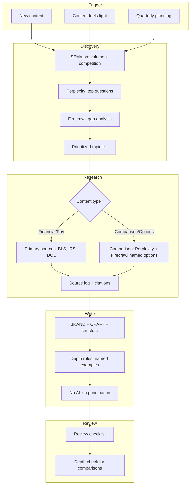

# Career Hub Content Process

Single source of truth for the Career Hub content lifecycle: discovering topics, researching sources, writing articles, reviewing quality, optimizing existing content, and auditing the library.

Editorial rules (voice, CRAFT framework, Real Advice standards, punctuation, AI slop list) live in **[BRAND.md](./BRAND.md)**. This document covers *process*; BRAND.md covers *standards*.

---

## Table of Contents

1. [Content Lifecycle](#1-content-lifecycle)
2. [Discovery](#2-discovery)
3. [Research](#3-research)
4. [Creation](#4-creation)
5. [Review & QA](#5-review--qa)
6. [Optimization](#6-optimization)
7. [Audit](#7-audit)
8. [Appendix: Tool & API Reference](#appendix-tool--api-reference)

---

## 1. Content Lifecycle

Every piece of content follows this loop. Enter at the appropriate phase depending on the trigger.

| Trigger | Entry point |
|---------|-------------|
| **New content** | Discovery → Research → Create → Review → Publish |
| **Content feels light** | Discovery + Research, then rewrite with depth |
| **Feedback received** | Optimization (categorize → apply → verify) |
| **Quarterly planning** | Discovery across all pillars; prioritize refresh candidates |



---

## 2. Discovery

Run discovery **before creating new content** to avoid writing articles with no search demand.

### 2.1 Keyword Research Sources

| Source | Use case | How |
|--------|----------|-----|
| **SEMrush** | Volume, competition, CPC | `semrush-keyword` Edge Function |
| **Google Keyword Planner** | Volume, competition | Manual; document in pipeline |
| **People Also Ask (PAA)** | Related questions for FAQ/H2s | Scrape SERP or Perplexity |
| **Google Trends** | Seasonal interest, rising topics | Manual or API |
| **Perplexity** | "What do temp workers search for about [topic]?" | `perplexity-search` Edge Function |
| **Firecrawl** | Scrape competitor pages, SERP snippets | `firecrawl-scrape` Edge Function |
| **Search Console** | Queries already driving traffic | Manual; add to audit when available |

### 2.2 Discovery Workflow

1. **Keyword research** — SEMrush for volume + competition on target keywords
2. **Question mining** — Perplexity for "top questions temp workers ask about [topic]"
3. **Gap analysis** — Firecrawl top SERP results; compare their H2s, FAQs, and coverage to ours; list what we don't cover
4. **Comparison discovery** (if applicable) — Perplexity for named list + citations; Firecrawl 2–3 sites for verification
5. **Prioritize** — Demand (volume/PAA) + gap (we don't cover it) + fit (Career Hub pillars)
6. **Output** — Prioritized topic list with demand signals → feed into Research

### 2.3 Demand Signals

| Signal | What it tells you |
|--------|-------------------|
| Volume | How many people search this |
| Competition | Keyword difficulty |
| PAA | Related questions (good for FAQ, H2s) |
| Trending | Seasonal or rising interest |
| Gap | What top SERP results cover that we don't |

### 2.4 When to Run Discovery

| Trigger | Action |
|---------|--------|
| New section | Full discovery for that pillar |
| "Content feels light" feedback | Gap analysis on that topic |
| Quarterly planning | Discovery across all pillars |
| Low engagement | Check analytics; discovery for underperforming topics |

---

## 3. Research

**Source first, write second.** No exceptions for financial content.

### 3.1 Source Hierarchy (Four-Source Rule)

| Tier | Source type | Examples |
|------|------------|----------|
| **1 — Platform** | Indeed Flex data | Agree with data team first. Attribute to "Indeed Flex data." |
| **2 — Official** | US government / regulatory | BLS, IRS, DOL, EEOC, state labor boards |
| **3 — Industry** | Workforce/HR research | SIA, Lightcast, SHRM, NRA, Toast Report |
| **4 — Validated** | Reputable journalism / verified testimony | NYT, WSJ (labour reporting), first-person accounts with consent |

**Never:** Other blogs, career sites, AI-generated statistics.

### 3.2 Content Type → Source Requirements

| Content type | Required sources |
|--------------|------------------|
| **Financial / YMYL** | IRS, DOL, BLS, state agencies only. Link to official pages. |
| **Pay / rights** | BLS OEWS, state labor depts, wage-report methodology |
| **Career / how-to** | BLS OOH, O*NET, research-templates.ts |
| **Certifications** | State ABC boards, OSHA, NRA (ServSafe), official cert provider sites |
| **Comparison / options** | Perplexity (named list + citations), Firecrawl (2–3 sites), BLS/SIA or official |

### 3.3 Research Rules

| Rule | Detail |
|------|--------|
| Source first | Find primary source before writing. No "write then source." |
| Inline citations | "According to BLS OEWS (2025), median pay is..." — not footnotes |
| Date everything | "BLS OEWS May 2025 release", "IRS 2026 mileage rate" |
| Caveat variance | "Rates vary by state/location/employer, so check the listing." |
| No AI stats | Never use a number from an LLM without primary-source verification |
| Use data-sources.ts | Central registry of approved sources; add new sources there before use |

### 3.4 Comparison / Options Articles

| Step | Action |
|------|--------|
| 1 | Perplexity: "Top [N] [category] in the US with markets, industries, pay structure. Cite sources." |
| 2 | Firecrawl: Scrape 2–3 official sites for markets, offerings, verification |
| 3 | BLS/SIA or official source: At least one Tier 2–3 stat |
| 4 | Output: Named list (5+ options) with markets, pay type, industries. No "and others." |

### 3.5 Financial Content — Additional Requirements

- Every dollar amount needs a source or "rates vary" caveat
- Tax rates, limits, deadlines — verify against IRS.gov, state tax agency
- Benefits/retirement — verify against DOL, healthcare.gov, official provider sites
- Add verification note: "Consider having a US tax professional or payroll specialist review your specific case."
- Specialist sign-off required for articles in the [Verification Queue](#verification-queue)

### 3.6 Data Source Registry

Central registry: `src/lib/data/data-sources.ts`

| Source ID | Name | Use for |
|-----------|------|---------|
| bls-oews | BLS Occupational Employment and Wage Statistics | Wage percentiles, employment counts |
| bls-ooh | BLS Occupational Outlook Handbook | Job outlook, median pay, education |
| bls-qcew | BLS Quarterly Census of Employment and Wages | Industry employment, regional data |
| indeed-flex | Indeed Flex Internal Market Data | Shift rates, market demand |
| toast-report | Toast Restaurant Technology Report | Tip income, restaurant wages |
| nra-data | National Restaurant Association | Hospitality employment |
| state-labor | State Labor Department Data | State-level wages, unemployment |
| census-acs | US Census American Community Survey | Cost of living, demographics |

---

## 4. Creation

Follow [BRAND.md](./BRAND.md) for voice, CRAFT framework, article structure, and Real Advice standards. Key writing rules:

| Requirement | Detail |
|-------------|--------|
| CRAFT | Contextual, Real (score 2+), Actionable, Fresh, Trustworthy |
| Depth (comparison articles) | 5+ named options; no "and others" |
| Punctuation | No em dashes; use comma, colon, or parentheses |
| Phrasing | No "delve", "navigate", "when it comes to", "in today's" |
| Length (comparisons) | 800–1,200 words minimum |
| Voice | Warm, clear, empowering, honest; Grade 8 reading level |
| Indeed Flex placement | Natural, not shoehorned; no mercenary CTAs |
| Jargon | Defined on first use |

---

## 5. Review & QA

Run this checklist before publishing any content.

### 5.1 Research & Sourcing

| Check | Pass if |
|-------|---------|
| Source first | Every claim traced to Tier 1–4 source |
| Inline citations | Numbers and claims cited in-sentence, not footnotes |
| Dates | Source dates included (e.g. "BLS OEWS May 2025") |
| Caveats | Variance noted where applicable ("rates vary by state", "check the listing") |
| No AI stats | No numbers from LLM without primary source verification |
| Financial / YMYL | IRS, DOL, BLS, state agencies only; verification note present |

### 5.2 Brand & Voice

| Check | Pass if |
|-------|---------|
| CRAFT | Contextual, Real (score 2+), Actionable, Fresh, Trustworthy |
| Real Advice | At least 2 of: sourced statistic, platform data, actionable specificity, state variance, worker insight |
| AI Slop | No unverifiable stats, generic advice, B2B language, AI-style phrasing |
| Punctuation | No em dashes; no "delve", "navigate", "when it comes to" |
| Voice | Warm, clear, empowering, honest; Grade 8 reading level |
| Indeed Flex | Not shoehorned; natural placement; not mercenary CTAs |
| Jargon | Defined on first use |

### 5.3 UI/UX

| Check | Pass if |
|-------|---------|
| Layout | StandardPageLayout, breadcrumbs, InternalLinkHub, CTASection |
| Scannability | H2/H3 hierarchy, bullet lists, bold key phrases, max 4-line paragraphs |
| Mobile | Responsive, touch targets, no horizontal scroll |
| Accessibility | Alt text on images, semantic headings, link purpose clear |
| CTAs | Clear next step, not mercenary |
| Tools | Links to Pay Calculator, Tax Calculator, etc. where relevant |

### 5.4 SEO

| Check | Pass if |
|-------|---------|
| Title tag | 50–60 chars, primary keyword in first 3 words |
| Meta description | 145–155 chars, keyword + soft CTA |
| H1 | One per page, matches title, keyword included |
| First 100 words | Primary keyword, who + what |
| Structured data | WebPage, Breadcrumb, FAQ, Article/HowTo as appropriate |
| Internal links | 2–3 per article, descriptive anchor text |
| Keyword alignment | Page targets a real search query |

### 5.5 User Usefulness

| Check | Pass if |
|-------|---------|
| Job-to-be-done | Specific task stated in intro or H1 |
| Intent match | Content matches (informational / transactional / navigational) |
| Actionable | Clear action step, link, or tool at end |
| Unique value | Real Advice score 2+; something beyond a 10-second Google |
| Moment-in-journey | When in job search this helps (implied or stated) |
| Outcome | Practical outcome described |
| Depth (comparisons) | 5+ named options with markets, pay, industries; no "and others" |

### 5.6 Factual Verification

| Check | Pass if |
|-------|---------|
| All claims traced | Every claim traceable to Tier 1–4 source |
| Source current | lastAccessed in data-sources.ts checked |
| Caveats | "Varies by state", "check the listing" where needed |
| Financial content | US tax/payroll specialist approval if applicable |
| Last reviewed | Date added to article |

### 5.7 Quick Run-Through

Before publish, answer:

1. **Research:** Can every claim be traced to a source?
2. **Brand:** Does it score 2+ on Real Advice? No AI slop?
3. **UI/UX:** Layout correct? Scannable? Accessible?
4. **SEO:** Title, meta, H1, first 100 words, structured data?
5. **Usefulness:** What will the reader do differently?
6. **Verification:** Financial content specialist-reviewed if needed?

---

## 6. Optimization

A repeatable workflow for improving existing content based on feedback.

### 6.1 Collect & Map Feedback

| Step | Action |
|------|--------|
| 1 | Collect feedback (copywriter, user testing, analytics) |
| 2 | For each item, identify: file path, section, line/block |
| 3 | Create a feedback log with location + suggested change |

**Example:**
```
Feedback: "Avoid B2B language like 'stay agile'"
Location: financial-tips.ts → irregular-income-budget → keyTakeaways[3]
Current: "Track expenses weekly, not monthly, to stay agile"
Change: "Track expenses weekly, not monthly, to keep on top of things"
```

### 6.2 Categorize Edits

Group by type for consistent application:

| Category | Examples | Reference |
|----------|----------|-----------|
| Voice / language | B2B terms, verbose phrasing, AI-style comparisons | BRAND.md Readability, Voice Pillars |
| Factual verification | Tax, benefits, retirement claims | Four-Source Rule, E-E-A-T |
| Structure | Article overlap, heading hierarchy | BRAND.md Article Structure, CRAFT |
| Indeed Flex placement | Shoehorning, mercenary CTAs | BRAND.md North Star |
| Audience mismatch | UK vs US, freelancer vs temp worker | BRAND.md Scope (US-first, temp workers) |
| Unclear terms | Jargon without definition | BRAND.md Readability Rules |
| Unrealistic targets | Savings goals without time period | BRAND.md Honest & Grounded |
| Overly negative framing | Fear-based lists | BRAND.md Empowering & Enabling |
| UI/UX | Layout, scannability, accessibility, CTAs | Review checklist §5.3 |
| SEO | Title, meta, H1, first 100 words, structured data | [SEO.md](./SEO.md) |
| User usefulness | Job-to-be-done, intent match, actionable outcome | Review checklist §5.5 |
| Depth | Comparison articles: 5+ named options, no "and others" | BRAND.md Depth Requirements |
| AI-ish punctuation | No em dashes; no "delve", "navigate", "when it comes to" | BRAND.md Punctuation and Phrasing |

### 6.3 Apply

1. **One category at a time** — e.g. do all voice/language edits first
2. **Preserve factual content** — optimize wording, don't change meaning without verification
3. **Check CRAFT** — each edit should improve Context, Real, Actionable, Fresh, or Trustworthy
4. **No new content** — optimization only unless explicitly scoped

### 6.4 Verify & Document

- Flag content needing specialist review → add to [Verification Queue](#verification-queue)
- Add "Last reviewed" date to articles when updated
- Add feedback-derived rules to BRAND.md when patterns emerge
- Log in the [Audit Template](#71-audit-template)

---

## 7. Audit

Living audit of the Career Hub content library. Review one article at a time against [BRAND.md](./BRAND.md) Real Advice Standards.

**Per-article process:**
1. Read full content
2. Run Real Advice Checklist — score 0–5
3. Run AI Slop Red Flags — list any found
4. Citation audit — every number/claim needs Tier 1–4 source
5. Log using the template below
6. If financial/YMYL: add to Verification Queue
7. Apply fixes

### 7.1 Audit Template

Copy for each article:

| Field | Value |
|-------|-------|
| File path | |
| Slug | |
| Title | |
| Content type | financial / guide / job-app / how-to / other |
| Real advice count | 0–5 |
| AI slop red flags | |
| Citation gaps | |
| Verification status | Pending / In progress / Verified |
| UI/UX | Pass / Issues |
| SEO | Pass / Issues |
| Target keyword | |
| User usefulness | 1–5 |
| User intent | Informational / Transactional / Navigational |
| Unique value | One-line summary |
| Last reviewed | |
| Fixes applied | |

### Verification Queue

Articles requiring specialist sign-off before claims are considered verified:

| Article | Verification needed | Status |
|---------|---------------------|--------|
| tax-tips | US payroll/tax specialist | Pending |
| gig-benefits | US HR/payroll | Pending |
| retirement-saving | US tax/pension specialist | Pending |

Add a verification note in content when review is pending: *"This guide provides general information. Tax rules vary by state and situation. Consider having a US tax professional or payroll specialist review your specific case."*

### Audit Priorities

| Tier | Scope | Priority |
|------|-------|----------|
| Tier 1 | Financial articles (YMYL) | High |
| Tier 2 | Guides with pay/rights claims | High |
| Tier 3 | Job application articles | Medium |
| Tier 4 | How-to-become | Medium |

---

## Appendix: Tool & API Reference

### SEMrush (Keyword Research)

```typescript
const response = await fetch(
  `${SUPABASE_URL}/functions/v1/semrush-keyword`,
  {
    method: 'POST',
    headers: {
      'Content-Type': 'application/json',
      'Authorization': `Bearer ${SUPABASE_ANON_KEY}`,
    },
    body: JSON.stringify({
      phrase: "temp worker tax tips",
      database: "us",
    }),
  }
);
const { success, phrase, primary, allResults } = await response.json();
```

- `phrase` (required): keyword to investigate
- `database`: regional database (default `us`)
- Response: `primary` contains `searchVolume`, `cpc`, `competition`, `results`

### Perplexity (SEO Research)

```typescript
const response = await fetch(
  `${SUPABASE_URL}/functions/v1/perplexity-search`,
  {
    method: 'POST',
    headers: {
      'Content-Type': 'application/json',
      'Authorization': `Bearer ${SUPABASE_ANON_KEY}`,
    },
    body: JSON.stringify({
      query: "What are the top 10 questions US temp workers ask about tax deductions?",
      options: {
        model: "sonar",
        search_recency_filter: "month",
      },
    }),
  }
);
const { success, content, citations } = await response.json();
```

- `query` (required): the research question
- `options.model`: `sonar` (default)
- `options.search_recency_filter`: `day` | `week` | `month` | `year`
- Response: `content` (markdown), `citations` (array of URLs)

### Firecrawl (Competitor Scraping)

```typescript
const response = await fetch(
  `${SUPABASE_URL}/functions/v1/firecrawl-scrape`,
  {
    method: 'POST',
    headers: {
      'Content-Type': 'application/json',
      'Authorization': `Bearer ${SUPABASE_ANON_KEY}`,
    },
    body: JSON.stringify({
      url: "https://example.com/competitor-article",
      options: {
        formats: ["markdown"],
        onlyMainContent: true,
      },
    }),
  }
);
const data = await response.json();
```

- `url` (required): full URL to scrape
- `options.onlyMainContent`: `true` (default) — strips nav, footer
- Response: Firecrawl API response with `markdown` field
