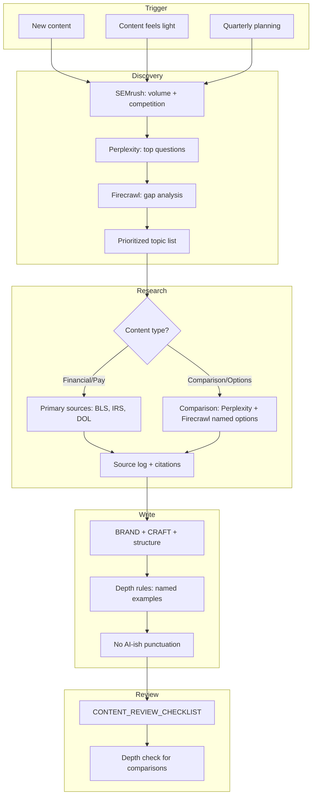

# Content Creation Loop

The recurring system for producing high-quality, engaging, useful, on-brand Career Hub content. Follow this loop for all new content and when existing content "feels light." No ad-hoc prompts required; the docs drive the process.

**References:** [CONTENT_DISCOVERY.md](./CONTENT_DISCOVERY.md), [RESEARCH_PIPELINE.md](./RESEARCH_PIPELINE.md), [BRAND.md](./BRAND.md), [CONTENT_REVIEW_CHECKLIST.md](./CONTENT_REVIEW_CHECKLIST.md)

---

## When to Run

| Trigger | Action |
|---------|--------|
| **New content** | Run full loop (Discovery through Publish) |
| **Content feels light** | Run Discovery + Research, then rewrite with depth |
| **Quarterly planning** | Run Discovery across pillars; prioritize refresh candidates |

---

## Phase 1: Discovery

Run [CONTENT_DISCOVERY.md](./CONTENT_DISCOVERY.md) for the topic area.

| Step | Action |
|------|--------|
| 1 | SEMrush: Check volume and competition for target keywords |
| 2 | Perplexity: "Top questions temp workers ask about [topic]" |
| 3 | Firecrawl: Gap analysis (top SERP results vs our content) |
| 4 | For comparison/options topics: Run [Comparison-Topic Discovery](./CONTENT_DISCOVERY.md#comparison-topic-discovery) |
| 5 | Output: Prioritized topic list with demand signals |

---

## Phase 2: Research

Run [RESEARCH_PIPELINE.md](./RESEARCH_PIPELINE.md). Source first, write second.

| Content type | Research steps |
|--------------|----------------|
| Financial/YMYL | IRS, DOL, BLS, state agencies only |
| Pay/rights | BLS OEWS, state labor, wage-report methodology |
| Career/how-to | BLS OOH, O*NET, research-templates.ts |
| **Comparison/options** | Perplexity (named list + citations), Firecrawl (2-3 sites), BLS/SIA or official |

Output: Source log with URLs and dates. For comparison articles: named list (5+ options) with markets, pay type, industries.

---

## Phase 3: Write

Follow [BRAND.md](./BRAND.md): CRAFT, Article Structure, Real Advice.

| Requirement | Reference |
|-------------|-----------|
| Depth (comparison articles) | 5+ named options; no "and others" |
| Punctuation | No em dashes; use comma, colon, or parentheses |
| Phrasing | No "delve", "navigate", "when it comes to", "in today's" |
| Length | Comparison articles: 800-1,200 words minimum |

---

## Phase 4: Review

Run [CONTENT_REVIEW_CHECKLIST.md](./CONTENT_REVIEW_CHECKLIST.md) before publish.

| Check | Pass if |
|-------|---------|
| Research | Every claim traced to Tier 1-4 source |
| Brand | Real Advice score 2+; no AI slop |
| Depth (comparison) | 5+ named options with markets, pay, industries |
| Punctuation | No em dashes; no AI opener phrases |
| UI/UX | Layout, scannability, accessibility |
| SEO | Title, meta, H1, first 100 words, structured data |

---

## Phase 5: Publish

- Add "Last reviewed" date to article
- Log in [CONTENT_AUDIT.md](./CONTENT_AUDIT.md) with all columns
- Add to sitemap if new page

---

## Loop Diagram

