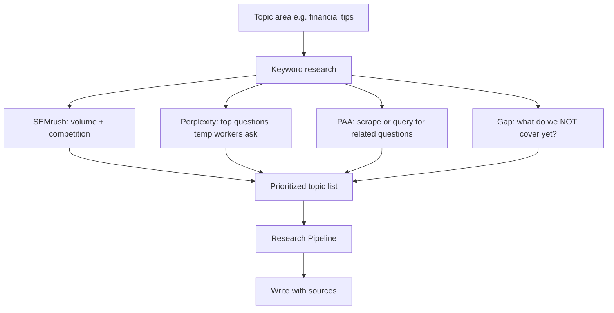

# Content Discovery Process

Process for finding high-demand topics before writing. **Run this before creating new content** to avoid low/no-demand articles.

**Reference:** [RESEARCH_PIPELINE.md](./RESEARCH_PIPELINE.md), [BRAND.md](./BRAND.md)

---

## Purpose

- Find what users actually search for
- Avoid creating content for low or no demand
- Prioritize topics that fit Career Hub pillars and have real search volume

---

## Keyword Research Sources

| Source | Use case | How |
|--------|----------|-----|
| **SEMrush** | Volume, competition, CPC for keywords | Call `semrush-keyword` Edge Function |
| **Google Keyword Planner** | Volume, competition (manual or export) | Manual process; document in pipeline |
| **People Also Ask (PAA)** | Related questions for FAQ, H2s | Scrape SERP or use Perplexity with "People also ask for [topic]" |
| **Google Trends** | Seasonal interest, rising topics | Manual or API |
| **Perplexity** | "What do temp workers search for about [topic]?" | Call `perplexity-search` Edge Function |
| **Firecrawl** | Scrape competitor pages, SERP snippets | Call `firecrawl-scrape` for URL |
| **Search Console** | Queries already driving traffic | Manual; add to audit when available |

---

## Discovery Workflow



---

## Demand Signals

| Signal | What it tells you |
|--------|-------------------|
| **Volume** | How many people search this (SEMrush, Google Keyword Planner) |
| **Competition** | Keyword difficulty (SEMrush) |
| **PAA** | Related questions users ask — good for FAQ, H2s |
| **Trending** | Seasonal or rising interest (Google Trends) |
| **Gap** | Top SERP results vs our content — what we don't cover |

---

## Gap Analysis

1. **Identify top SERP results** for target keyword (manual search or Firecrawl)
2. **Compare** their H2s, FAQs, and coverage to our existing content
3. **List gaps** — topics we don't cover that competitors do
4. **Prioritize** — high demand + gap + Career Hub pillar fit

---

## SEMrush Usage (Keyword Research)

Use the `semrush-keyword` Edge Function to get search volume, CPC, and competition for keywords. Run this first to validate demand before creating content.

**Example API call:**

```typescript
const response = await fetch(
  `${SUPABASE_URL}/functions/v1/semrush-keyword`,
  {
    method: 'POST',
    headers: {
      'Content-Type': 'application/json',
      'Authorization': `Bearer ${SUPABASE_ANON_KEY}`,
    },
    body: JSON.stringify({
      phrase: "temp worker tax tips",
      database: "us", // optional, default: us
    }),
  }
);
const { success, phrase, primary, allResults } = await response.json();
// primary: { searchVolume, cpc, competition, results }
```

**Request body:**
- `phrase` (required): Keyword or phrase to investigate
- `database`: Regional database (default `us` for US). See [SEMrush databases](https://developer.semrush.com/api/seo/overview/#databases).

**Response:**
- `success`: boolean
- `phrase`: The keyword queried
- `primary`: First result with `searchVolume`, `cpc`, `competition`, `results`
- `allResults`: Array of all results (for phrase_all or multi-DB)

**Setup:** Set `SEMRUSH_API_KEY` in Supabase secrets: `supabase secrets set SEMRUSH_API_KEY=your_key`

---

## Perplexity Prompts (SEO Research)

Use the `perplexity-search` Edge Function for:

- "What are the top 10 questions US temp workers ask about [topic]?"
- "People also ask for [topic] — what are common follow-up questions?"
- "What do gig workers search for when [scenario]?"

**Example API call** (from app or script):

```typescript
const response = await fetch(
  `${SUPABASE_URL}/functions/v1/perplexity-search`,
  {
    method: 'POST',
    headers: {
      'Content-Type': 'application/json',
      'Authorization': `Bearer ${SUPABASE_ANON_KEY}`,
    },
    body: JSON.stringify({
      query: "What are the top 10 questions US temp workers ask about tax deductions?",
      options: {
        model: "sonar",
        search_recency_filter: "month", // optional: day, week, month, year
      },
    }),
  }
);
const { success, content, citations } = await response.json();
```

**Request body:**
- `query` (required): The research question
- `options.model`: `sonar` (default) or other Perplexity model
- `options.search_domain_filter`: Limit to specific domains
- `options.search_recency_filter`: `day` | `week` | `month` | `year`

**Response:**
- `success`: boolean
- `content`: Markdown string with answer
- `citations`: Array of source URLs
- `model`: Model used

---

## Firecrawl Usage (SEO Research)

Use the `firecrawl-scrape` Edge Function to:

- Scrape competitor pages for H2 structure and coverage
- Capture SERP snippets (if you have SERP URLs)
- Extract content from top-ranking articles for gap analysis

**Example API call:**

```typescript
const response = await fetch(
  `${SUPABASE_URL}/functions/v1/firecrawl-scrape`,
  {
    method: 'POST',
    headers: {
      'Content-Type': 'application/json',
      'Authorization': `Bearer ${SUPABASE_ANON_KEY}`,
    },
    body: JSON.stringify({
      url: "https://example.com/competitor-article",
      options: {
        formats: ["markdown"],
        onlyMainContent: true,
      },
    }),
  }
);
const data = await response.json();
// data.markdown or data.data.content contains scraped content
```

**Request body:**
- `url` (required): Full URL to scrape (http/https)
- `options.formats`: `["markdown"]` (default) or other formats
- `options.onlyMainContent`: `true` (default) — strips nav, footer
- `options.waitFor`: Optional selector to wait for
- `options.location`: Optional geo for localized content

**Response:** Firecrawl API response (includes `markdown`, `data`, etc.)

---

## When to Run Discovery

| Trigger | Action |
|---------|--------|
| **New section** | Run full discovery for that pillar |
| **"Content feels light" feedback** | Run gap analysis on that topic |
| **Quarterly planning** | Run discovery across all pillars |
| **Low engagement** | Check analytics; run discovery for underperforming topics |

---

## Ownership and Frequency

- **Who:** Content lead or assigned researcher
- **Frequency:** Before new content creation; quarterly for existing sections
- **Output:** Prioritized topic list with demand signals, fed into [RESEARCH_PIPELINE.md](./RESEARCH_PIPELINE.md)

---

## Integration with New Content Creation

1. **Discovery** — Run this process for the topic area
2. **Prioritize** — Demand (volume/PAA) + gap (we don't cover it) + fit (Career Hub pillars)
3. **Research** — Run [RESEARCH_PIPELINE.md](./RESEARCH_PIPELINE.md) (source first)
4. **Write** — Follow [BRAND.md](./BRAND.md), CRAFT, Article Structure
5. **Review** — Run [CONTENT_REVIEW_CHECKLIST.md](./CONTENT_REVIEW_CHECKLIST.md)
6. **Publish** — Add to sitemap, log in [CONTENT_AUDIT.md](./CONTENT_AUDIT.md)
