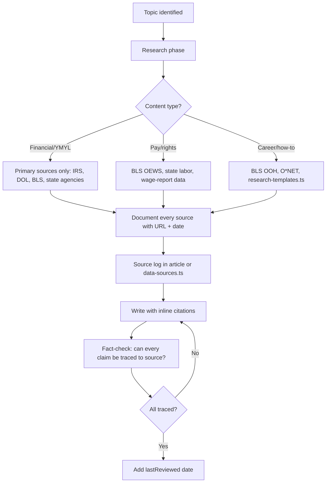

# Research Pipeline for Content Creation

Mandatory process for creating or updating Career Hub content. **Source first, write second.** No exceptions for financial content.

**Reference:** [BRAND.md](./BRAND.md) — Four-Source Rule, Real Advice Standards, Financial Content (YMYL)

---

## Process Flow

---

## Research Pipeline Rules

| Step | Action |
|------|--------|
| **1. Source first** | Find primary source (BLS, IRS, DOL, state) before writing. No "write then source." |
| **2. Use research-templates.ts** | [research-templates.ts](../src/lib/data/research-templates.ts) defines approved sources. Add new sources there before use. |
| **3. Inline citations** | "According to BLS OEWS (2025), median pay is..." not footnotes. |
| **4. Date everything** | "BLS OEWS May 2025 release", "IRS 2026 mileage rate" |
| **5. Caveat variance** | "Rates vary by state/location/employer—check the listing." |
| **6. No AI-generated stats** | Never use a number from an LLM without verifying against primary source. |

---

## Source Hierarchy (Four-Source Rule)

| Tier | Source type | Examples |
|------|-------------|----------|
| **1 — Platform** | Indeed Flex data | Agree with data team first. Attribute to 'Indeed Flex data'. |
| **2 — Official** | US government / regulatory | BLS, IRS, DOL, EEOC, state labor boards |
| **3 — Industry** | Workforce/HR research | SIA, Lightcast, SHRM, NRA, Toast Report |
| **4 — Validated** | Reputable journalism / verified testimony | NYT, WSJ (labour reporting), first-person accounts with consent |

**Never:** Other blogs, career sites, AI-generated statistics.

---

## Content Type → Source Requirements

| Content type | Required sources |
|--------------|------------------|
| **Financial/YMYL** | IRS, DOL, BLS, state agencies only. Link to official pages. |
| **Pay/rights claims** | BLS OEWS, state labor depts, [wage-report methodology](../src/lib/data/wage-report/methodology.ts) |
| **Career/how-to** | BLS OOH, O*NET, [research-templates.ts](../src/lib/data/research-templates.ts) |
| **Certifications** | State ABC boards, OSHA, NRA (ServSafe), official cert provider sites |

---

## Data Source Registry

Central registry: [data-sources.ts](../src/lib/data/data-sources.ts)

| Source ID | Name | Use for |
|-----------|------|---------|
| bls-oews | BLS Occupational Employment and Wage Statistics | Wage percentiles, employment counts |
| bls-ooh | BLS Occupational Outlook Handbook | Job outlook, median pay, education |
| bls-qcew | BLS Quarterly Census of Employment and Wages | Industry employment, regional data |
| indeed-flex | Indeed Flex Internal Market Data | Shift rates, market demand |
| toast-report | Toast Restaurant Technology Report | Tip income, restaurant wages |
| nra-data | National Restaurant Association | Hospitality employment |
| state-labor | State Labor Department Data | State-level wages, unemployment |
| census-acs | US Census American Community Survey | Cost of living, demographics |

---

## Fact-Check Before Publish

For every claim in the article, ask:

1. **Can I trace this to a Tier 1–4 source?** If no, remove or reframe.
2. **Is the source current?** Check lastAccessed in data-sources.ts.
3. **Does the claim need a caveat?** "Varies by state", "check the listing", etc.
4. **Financial content:** Would a US tax/payroll specialist approve this?

---

## Financial Content — Additional Requirements

- **Every dollar amount** must have a source or "rates vary" caveat
- **Tax rates, limits, deadlines** — verify against IRS.gov, state tax agency
- **Benefits/retirement** — verify against DOL, healthcare.gov, official provider sites
- **Add verification note:** "Consider having a US tax professional or payroll specialist review your specific case."
- **Specialist sign-off required** for: tax-tips, gig-benefits, retirement-saving (see [CONTENT_OPTIMIZATION.md](./CONTENT_OPTIMIZATION.md))
